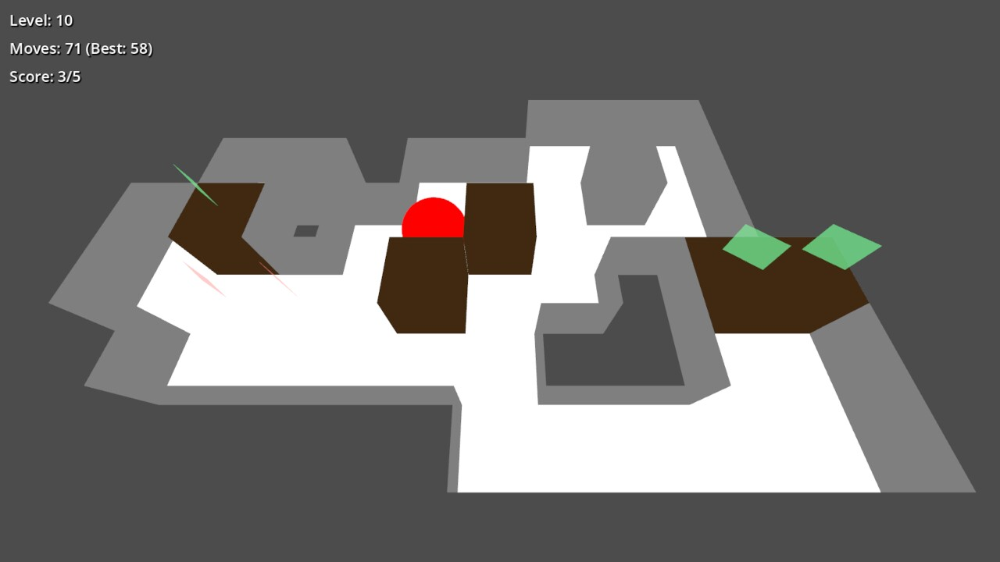

# Soko Clone Prototype

A prototype Sokoban clone with a level editor and level pack support. Meant to be a small-ish project for learning some more [Godot](https://godotengine.org).

Made with [Godot](https://godotengine.org) 4.1.3, upgraded to 4.2.

## Running

The project can probably be started with this version or later. Once it's been opened, it can just be run normally the same as any other [Godot](https://godotengine.org) project (the default is the F5 key).

## Playing

The game starts on the level pack selection screen. Select a level pack or create one to continue. Also, there is no sound, so expect silence. You can also quit from the pack selection screen by pressing Escape.

Selecting an existing pack should start at the first level. Creating a new pack will start you in an empty level in the level editor. In both cases, read the instructions at the bottom-left for more info on how to use this thing.

This project sadly has no mobile support or gamepad support. Only PC and browser with a keyboard (and mouse on the pack selection screen).

## Future enhancements

Probably won't ever be any, but PRs are welcome! See [TODO.md](TODO.md) for some ideas that didn't make it in.
